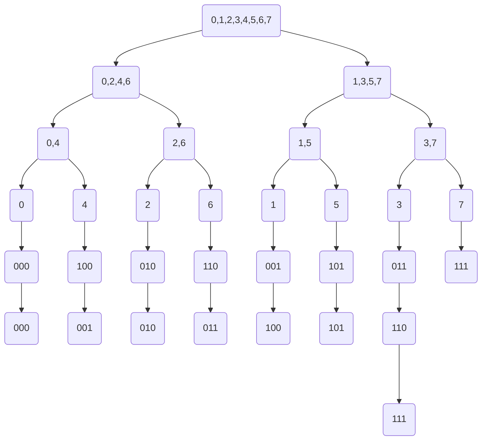

* content
{:toc}

## 1 前言
作为一名OI选手，至今未写过fft相关的博客，真是一大遗憾，这也导致我并没有真正推过fft的所有式子
这一篇fft的博客我将详细介绍多项式乘法，~~易于理解，主要是为了等我啥时候忘了回来看~~，当然，一些公式会有些枯燥，如果是初学者请耐心看完哦，还有，毕竟这是手写出来的，如果有错误，欢迎指正！
## 2 介绍
**本栏用来普及一些知识和对FFT的思路进行描述**
多项式乘法，顾名思义，首先是讲到多项式，那么什么是多项式呢？
#### 2.1 多项式
首先是多项式的定义，想必大家都知道(~~你上过初中吧~~)，而在这里，我们所说的多项式都是单个未知数x的
所以，在我们正常人眼中的一个次多项式就是形如$$f(x)=a_0x^0+a_1x^1+···+a_{n-1}x^{n-1}$$
没错，这就是大名鼎鼎的**系数表示法**
然后呢，由于在后面要用到，所以我在这里再介绍一种**点值表示法**
就是将n个不同的值$x_0,x_1···x_{n-1}$分别带入$f(x)$，获得n个结果$y_0,y_1···y_{n-1}$，这n对数$(x_0,y_0),(x_1,y_1)···(x_{n-1},y_{n-1})$就可以表示出这个多项式
*看到这里，如果你是初学者，你一定会感到非常迷茫，这为什么对呢？*
*看到这里，如果你是个FFT高手，你可能会感到迷茫，这为什么对呢？*
（dalao勿喷）

这张图片里系数表示法相当于是最右侧的那个矩阵
而点值表示法则包含了左边的两个矩阵，可以通过这两个矩阵计算出最右侧的那个矩阵，所以两种表示法是等价的
*撒花*
**注：另外要说的是，由于算法需要，本博客所说的n次多项式都默认n是2的幂次（如果不足可以添加0来补）**
#### 2.2多项式的乘法
~~在做了那么久的各种数学题后，我对多项式乘法有了有了的理解~~
对于一个一般的给定系数表示法的多项式乘法问题
比如两个n次多项式A(x),B(x)，给出系数表示法，求它们的乘积C(x)
分别枚举两个多项式中的每一项，分别是$O(n)的$，所以总复杂度为$O(n^2)$
这是一个很方便的做法

你可以发现一件很有趣的事情，那就是如果给出的是点值表示法，并且两个多项式的x分别对应相等，那么把y对应相乘，就能$O(n)$的获取乘积的点值表示法
#### 2.3 快速傅立叶变换（FFT）
那么，FFT是用来干什么的呢？
对于一个多项式乘法问题，当给出系数表示法的时候，$O(n)$的复杂度有时候并不足够优越，而FFT就是一个能使多项式乘法做到$O（nlogn）$的一个算法，具体的原理其实非常清晰

- 两个多项式的系数表示法
*求值，O(nlogn)*
- 两个多项式的点值表示法
*点值乘法，O(n)*
- 两个多项式乘积的点值表示法
*插值，O(nlogn)*
- 两个多项式乘积的系数表示法

是不是一目了然呢？当然，要具体实现，还需要细细说来
## 3 实现
现在你已经大致知道FFT要干什么了，现在你已经会在点值情况下$O(n)$进行多项式乘法，剩下的就是要解决两个问题——求值与插值了
#### 3.1 暴力算法（$O(n^3)$）
~~要先做题，必先暴力~~
首先是求值，加入你现在随便找了n个互不相同的x，带入其中，是什么复杂度呢$O(n^2)$的
然后是插值，有一个非常妙的方法，假设所有的a都是未知数，那么这个问题就变成了经典的高斯消元问题，复杂度$O(n^3)$
不好意思，这两个操作的复杂度都光荣的在$O(n^2)$以上，使得当前这个算法的总复杂度为$O(n^3)$，**比文章开始的那个$O（n^2）$都要差**，不要灰心，既然复杂度不优，那就循序渐进的优化
#### 3.2 离散傅里叶变换（通过优化使上面算法复杂度降到$O(n^2)$，请仔细看完，这是基础）
你会发现，点值表示法有一个很好的特性，就是那个代入的x可以自己选择
离散傅里叶变换的思路是将n个x的值取n个单位根（模长为一的复数）
>###### 复数（这是一个知识拓展框）
>$\sqrt{-1}$这个数，在实数范围内是不存在的，所以拓展出复数这一概念，**设$i=\sqrt{-1}$，复数就是能够被表示为$z=x+y*i$的数**。所以对一个复数，可以用有序数对(x,y)表示，在坐标轴上有对应的点，而这个复数就是从(0,0)到(x,y)的一条有向线段（~~只会向量的同学可以把它看成向量~~），而这个**复数的模长就等于(0,0)到(x,y)的距离**
>由于复数是数，所以也有各种运算
>加法：(a+bi)+(c+di)=(a+c)+(b+d)i
>减法：(a+bi)-(c+di)=(a-c)+(b-d)i
>乘法：(a+bi)*(c+di)=(ac-bd)+(ad+bc)i
>当然，C++有专门的complex变量可以声明，但是
>###### **不推荐使用！！！**
>为什么呢？因为FFT本身就有一定的常数，如果再用系统complex常数会更大，所以推荐自己手写struct

那么什么是单位根呢？
##### 3.2.1 单位根
单位根所在的点是把单位圆（以原点为圆心，半径为1的圆）从（0,1）开始平均分成n份的分割点
如下图，这就是n=8时的单位圆，绿色圆上的红点就是单位根所在的点

从(0,1)开始逆时针将这n个点编号，所表示的单位根分别为$w_n^1,w_n^1···,w_n^{n-1}$，特殊的，$w_n^1$被称为n次单位根。容易发现每个单位根都非常好算，即$$w_n^k=(cos\frac{k}{n} 2π,sin\frac{k}{n} 2π) $$
这个用三角函数的想法非常好证
知道了这个之后，你会发现很多性质
###### 性质1：$w_n^k=(w_n^1)^k$
证明：
$\ \ \ w_n^k*w_n^1\\
=(cos\frac{k}{n} 2π,sin\frac{k}{n} 2π)*(cos\frac{1}{n} 2π,sin\frac{1}{n} 2π)\\
=(cos\frac{k}{n} 2π*cos\frac{1}{n} 2π-sin\frac{k}{n} 2π*sin\frac{1}{n} 2π,
sin\frac{k}{n} 2π*cos\frac{1}{n} 2π+cos\frac{k}{n} 2π*sin\frac{1}{n} 2π)\\
=(cos\frac{k+1}{n} 2π,sin\frac{k+1}{n} 2π)\\
=w_n^{k+1}$

如果你想问倒数第二个等号怎么等于过去的，请查看
>和角公式百度链接：https://baike.baidu.com/item/%E5%92%8C%E8%A7%92%E5%85%AC%E5%BC%8F/8782319?fr=aladdin
###### 性质2：对于任意一个正整数x，$w_{n*x}^{k*x}=w_n^k$
证明：
$\ \ \ w_{n*x}^{k*x}\\
=(cos\frac{k*x}{n*x} 2π,sin\frac{k*x}{n*x} 2π)\\
=(cos\frac{k}{n} 2π,sin\frac{k}{n} 2π)\\
=w_n^k$
没错，约分大法好，这个等式说明，这两个数在单位圆上对应的点是同一个，这个性质，使$w_{2n}^{2k}=w_n^k$
###### 性质3：如果n是偶数，那么$w_n^{k+\frac n2}=-w_n^k$
证明：
$\ \ \ w_n^{k+\frac n2}\\
=(cos\frac{k+\frac n2}{n} 2π,sin\frac{k+\frac n2}{n} 2π)\\
=(-cos\frac{k}{n} 2π,-sin\frac{k}{n} 2π)\\
=-(cos\frac{k}{n} 2π,sin\frac{k}{n} 2π)\\
=-w_n^k$
诱导公式大法好，
$sin（π+α）= －sinα$
$cos（π+α）=－cosα$
理解一下，相当于这两者是单位圆上相对的两个点，值自然是取相反数的啦
##### 3.2.2代入单位根带来的性质
你现在已经知道单位根是什么啦
那么，我们回头看这个离散傅里叶变换，它是求值的时候把x的值分别取$w_n^0,w_n^1···w_n^{n-1}$这n个数，究竟这么做有什么好处呢？
答案是——你可以**比较方便的实现插值！！！**
哇塞，这真是很牛逼的呢，**插值是暴力算法的瓶颈，如果能优化，那就可以优化总复杂度了**
那么如何优化呢？

现在定义对函数f(x)的 离散傅里叶变换为将$w_n^0,w_n^1···w_n^{n-1}$这n个数作为$x_0,x_1···x_{n-1}$代入， 离散傅里叶变换的结果为$(y_0,y_1···y_{n-1})$，容易发现，这是一个插值的过程
然后有一个结论：
**一个多项式A(x)在进行离散傅里叶变换后，将离散傅里叶变换的结果的n个y作为系数组成多项式B(x)，原来的n个单位根取倒数进行求值，结果的每个数除以n，其结果就是A(x)的各项系数**
文字说的可能不太清晰，用数字来表达就是这样的：

---
$A(x)=a_0x^0+a_1x^1+···+a_{n-1}x^{n-1}$
将$w_n^0,w_n^1···w_n^{n-1}$作为x分别带入求值
得到$(y_0,y_1···y_{n-1})$
将这些y作为系数，产生一个新的多项式B(x)
$B(x)=y_0x^0+y_1x^1+···+y_{n-1}x^{n-1}$
将$w_n^{-0},w_n^{-1}···w_n^{-(n-1)}$作为x分别带入求值
得到的$(z_0,z_1···z_{n-1})$
对于每个$z_k$，有$z_k=a_k*n$

**证明**：

$z_k=\sum_{i=0}^{n-1}y_i*(w_n^{-k})^i\\
\ \ \ \ \  =\sum_{i=0}^{n-1}(\sum_{j=0}^{n-1}a_j*(w_n^i)^j)*(w_n^{-k})^i\\
\ \ \ \ \ =\sum_{i=0}^{n-1}\sum_{j=0}^{n-1}a_j*(w_n^i)^j*(w_n^{-k})^i\\
\ \ \ \ \ =\sum_{j=0}^{n-1}\sum_{i=0}^{n-1}a_j*w_n^{i*j}*w_n^{-k*i}\\
\ \ \ \ \ =\sum_{j=0}^{n-1}a_j(\sum_{i=0}^{n-1}(w_n^{j-k})^i)$
然后对于$\sum_{i=0}^{n-1}(w_n^{j-k})^i$，容易发现
如果$j-k= 0$那么$w_n^{j-k}$就是$w_n^1=1$，所以n个1结果为n
若果$j-k\neq0$那么通过等比数列求和（$x^0+x^1+···+x^{n-1}=\frac {x^n-1}{x-1}$）可以发现，结果$\frac {(w_n^{j-k})^n-1}{w_n^{j-k}-1}=\frac {(w_n^n)^{j-k}-1}{w_n^{j-k}-1}=\frac {1^{j-k}-1}{w_n^{j-k}-1}=0$
所以说，这个系数只有在$j-k=0$即$j=k$时才为n，其它都为0
所以$z_k=a_k*n$
证毕

---
对于这个结论，你会发现，如果你用离散傅里叶变换，你的插值就变成了一次求值，你现在的瓶颈也就变成了只有求值这个操作了，NICE!
现在暴力带入的求值的复杂度为$O(n^2)$，所以整个算法的复杂度也为$O(n^2)$
#### 3.3 快速傅里叶变换（使整个算法复杂度优化到$O(nlogn)$）
现在的复杂度变成$O(n^2)$了，你可能会说，这不是和暴力一样的复杂度嘛，学了老半天，还是个大常数$O(n^2)$，真没用
别着急，现在算法瓶颈在于求值，只要优化它的复杂度，算法就能变优
然后**快速傅里叶变换**就来了
>*Q：傅里叶就可以为所欲为吗？*
*A：没错，傅里叶就是可以为所~~猥琐~~欲为！*
解释：来一个[傅里叶百度百科的链接](https://baike.baidu.com/item/%E8%AE%A9%C2%B7%E5%B7%B4%E6%99%AE%E8%92%82%E6%96%AF%C2%B7%E7%BA%A6%E7%91%9F%E5%A4%AB%C2%B7%E5%82%85%E9%87%8C%E5%8F%B6/1694029?fr=aladdin#2)，他作为一名数学家、物理学家，在计算机发明100+年前就弄出了这个傅里叶变换！！！太巨了orz

现在要做的是，对于一个多项式$A(x)=a_0x^0+a_1x^1+···+a_{n-1}x^{n-1}$，我们需要快速的获得代入$w_n^0,w_n^1···w_n^{n-1}$的结果（如果这个ok那么代入$w_n^{-0},w_n^{-1}···w_n^{-(n-1)}$也行）
这个快速傅里叶的一个思路就是分治
首先把这个多项式按次数奇偶分组
$A(x)=(a_0x^0+a_2x^2+···+a_{n-2}x^{n-2})+(a_1x^1+a_3x^3+···+a_{n-1}x^{n-1})$
设
$A_1(x)=(a_0x^0+a_2x^1+···+a_{n-2}x^{\frac n2-1})$
$A_2(x)=(a_1x^0+a_3x^1+···+a_{n-1}x^{\frac n2-1})$
那么有
$A(x)=A_1(x^2)+x*A_2(x^2)$
对于所有的k
如果$k<\frac n2$，那么直接带入，有
$A(w_n^k)=A_1(w_n^{2k})+w_n^k*A_2(w_n^{2k})\\
\ \ \ \ \ \ \ \ \ \ \ \ =A_1(w_n^{2k})+w_n^k*A_2(w_n^{2k})\\
\ \ \ \ \ \ \ \ \ \ \ \ =A_1(w_{\frac n2}^k)+w_n^k*A_2(w_{\frac n2}^k)$
如果$k\geq\frac n2$，同样带入，有

$A(w_n^{k+\frac n2})=A_1(w_n^{2k+n})+w_n^{k+\frac n2}*A_2(w_n^{2k+n})\\
\ \ \ \ \ \ \ \ \ \ \ \ \ \ \ \ =A_1(w_n^{2k}*w_n^n)+w_n^{k+\frac n2}*A_2(w_n^{2k}*w_n^n)\\
\ \ \ \ \ \ \ \ \ \ \ \ \ \ \ \ =A_1(w_n^{2k})-w_n^k*A_2(w_n^{2k})$
然后现在如果知道$A_1(x)$和$A_2(x)$代入$w_{\frac n2}^0,w_{\frac n2}^1···w_{\frac n2}^{\frac n2-1}$的值，那$A(x)$代入$w_n^0,w_n^1···w_n^{n-1}$的值也可以$O(n)$计算出来了，然后递归解决问题
递归会有终止条件，当n=1的时候带入$w_1^0$的值就是那个多项式的$a_0$，就可以直接return了
考虑时间复杂度的分析$$T(n)=2*T(\frac n2)+O(n)$$
总复杂度是$O(nlogn)$的，完成！
在FFT说完之际，贴一个经典的揭示暴力多项式乘法和FFT不同的图：
然后你就会写FFT了，贴一个FFT的递归写法：
```c
#include<cstdio>
#include<cctype>
#include<cmath>
namespace fast_IO
{
    const int IN_LEN=10000000,OUT_LEN=10000000;
    char ibuf[IN_LEN],obuf[OUT_LEN],*ih=ibuf+IN_LEN,*oh=obuf,*lastin=ibuf+IN_LEN,*lastout=obuf+OUT_LEN-1;
    inline char getchar_(){return (ih==lastin)&&(lastin=(ih=ibuf)+fread(ibuf,1,IN_LEN,stdin),ih==lastin)?EOF:*ih++;}
    inline void putchar_(const char x){if(oh==lastout)fwrite(obuf,1,oh-obuf,stdout),oh=obuf;*oh++=x;}
    inline void flush(){fwrite(obuf,1,oh-obuf,stdout);}
}
using namespace fast_IO;
#define getchar() getchar_()
#define putchar(x) putchar_((x))
typedef long long LL;
#define rg register
template <typename T> inline void read(T&x)
{
    char cu=getchar();x=0;bool fla=0;
    while(!isdigit(cu)){if(cu=='-')fla=1;cu=getchar();}
    while(isdigit(cu))x=x*10+cu-'0',cu=getchar();
    if(fla)x=-x;  
}
template <typename T> void printe(const T x)
{
    if(x>=10)printe(x/10);
    putchar(x%10+'0');
}
template <typename T> inline void print(const T x)
{
    if(x<0)putchar('-'),printe(-x);
    else printe(x);
}
const int maxn=2097153;
const double Pi=acos(-1.0);
struct complex
{
    double x,y;
    inline complex operator +(const complex b)const{return (complex){x+b.x,y+b.y};}
    inline complex operator *(const complex b)const{return (complex){x*b.x-y*b.y,x*b.y+y*b.x};}
    inline complex operator -(const complex b)const{return (complex){x-b.x,y-b.y};}
}a[maxn],b[maxn];
int n,m,allsum;
void FFT(int lenth,complex*A,const int fla)
{
    if(lenth==1)return;
    complex A1[lenth>>1],A2[lenth>>1];
    for(rg int i=0;i<lenth;i+=2)A1[i>>1]=A[i],A2[i>>1]=A[i+1];
    FFT(lenth>>1,A1,fla),FFT(lenth>>1,A2,fla);
    const complex w=(complex){cos(Pi*2.0/lenth),sin(Pi*2.0/lenth)*fla};
    complex k=(complex){1,0};
    lenth>>=1;
    for(rg int i=0;i<lenth;i++,k=k*w)
    {
        A[i]=A1[i]+k*A2[i];
        A[i+lenth]=A1[i]-k*A2[i];
    }
}
int main()
{
    read(n),read(m),allsum=n+m;
    for(rg int i=0;i<=n;i++)read(a[i].x);
    for(rg int i=0;i<=m;i++)read(b[i].x);
    rg int lenth=1;while(lenth<=n+m)lenth<<=1;
    FFT(lenth,a,1),FFT(lenth,b,1);
    for(rg int i=0;i<=lenth;i++)a[i]=a[i]*b[i];
    FFT(lenth,a,-1);
    for(rg int i=0;i<=n+m;i++)print((int)(a[i].x/lenth+0.5)),putchar(' ');
    return flush(),0;
}
```
对代码的一些解释：
那个FFT()函数是用来求值的，前面已经证明过插值就是把单位根取倒数，所以单位根的标号传-1就好了
另外的部分都是模拟
## 4 优化
### 4.1 递归转迭代优化
之前贴的代码在某评测网站上运行最大数据点所花的时间为2493ms，题目数据范围是$n\leq1e6$，可见这个FFT的速度有一定的常数，这个时候就要考虑一些优化

首先想到的优化常数的算法自然是**把递归转迭代**了，而这种优化也是最为常见的

某一个写FFT的人发现如下性质：对于$a_x$这个数，递归到最后所在的位置刚好是x的二进制位全部翻转的那一位，比如说4的二进制是(100)，最后到了1(001)，更多的感兴趣可以自己手模
~~考虑到你可能连前面的都没看懂，没有能力手模，我还是把它画出来吧~~


你可以自行对比最后两排看看是不是这样
然后预处理二进制翻转的数组，然后就可以非递归的从底层一层一层往上做了，在我的代码中处理的是Reverse数组
贴一波代码
```c
#include<cstdio>
#include<cctype>
#include<cmath>
namespace fast_IO
{
	const int IN_LEN=10000000,OUT_LEN=10000000;
	char ibuf[IN_LEN],obuf[OUT_LEN],*ih=ibuf+IN_LEN,*oh=obuf,*lastin=ibuf+IN_LEN,*lastout=obuf+OUT_LEN-1;
	inline char getchar_(){return (ih==lastin)&&(lastin=(ih=ibuf)+fread(ibuf,1,IN_LEN,stdin),ih==lastin)?EOF:*ih++;}
	inline void putchar_(const char x){if(oh==lastout)fwrite(obuf,1,oh-obuf,stdout),oh=obuf;*oh++=x;}
	inline void flush(){fwrite(obuf,1,oh-obuf,stdout);}
}
using namespace fast_IO;
#define getchar() getchar_()
#define putchar(x) putchar_((x))
typedef long long LL;
#define rg register
template <typename T> inline void swap(T&a,T&b){T c=a;a=b;b=c;}
template <typename T> inline void read(T&x)
{
    char cu=getchar();x=0;bool fla=0;
    while(!isdigit(cu)){if(cu=='-')fla=1;cu=getchar();}
    while(isdigit(cu))x=x*10+cu-'0',cu=getchar();
    if(fla)x=-x;  
}
template <typename T> void printe(const T x)
{
    if(x>=10)printe(x/10);
    putchar(x%10+'0');
}
template <typename T> inline void print(const T x)
{
    if(x<0)putchar('-'),printe(-x);
    else printe(x);
}
const int maxn=2097153;const double PI=acos(-1.0);
int n,m;
struct complex
{
	double x,y;
	inline complex operator +(const complex b)const{return (complex){x+b.x,y+b.y};}
	inline complex operator -(const complex b)const{return (complex){x-b.x,y-b.y};}
	inline complex operator *(const complex b)const{return (complex){x*b.x-y*b.y,x*b.y+y*b.x};}
}a[maxn],b[maxn];
int lenth=1,Reverse[maxn];
inline void init(const int x)
{
	rg int tim=0;
	while(lenth<=x)lenth<<=1,tim++;
	for(rg int i=0;i<lenth;i++)Reverse[i]=(Reverse[i>>1]>>1)|((i&1)<<(tim-1));
}
inline void FFT(complex*A,const int fla)
{
	for(rg int i=0;i<lenth;i++)if(i<Reverse[i])swap(A[i],A[Reverse[i]]);
	for(rg int i=1;i<lenth;i<<=1)
	{
		const complex w=(complex){cos(PI/i),fla*sin(PI/i)};
		for(rg int j=0;j<lenth;j+=(i<<1))
		{
			complex K=(complex){1,0};
			for(rg int k=0;k<i;k++,K=K*w)
			{
				const complex x=A[j+k],y=A[j+k+i]*K;
				A[j+k]=x+y;
				A[j+k+i]=x-y;
			}
		}
	}
}
int main()
{
	read(n),read(m);
	init(n+m);
	for(rg int i=0;i<=n;i++)read(a[i].x);
	for(rg int i=0;i<=m;i++)read(b[i].x);
	FFT(a,1),FFT(b,1);
	for(rg int i=0;i<lenth;i++)a[i]=a[i]*b[i];
	FFT(a,-1);
	for(rg int i=0;i<=n+m;i++)print((int)(a[i].x/lenth+0.5)),putchar(' ');
	return flush(),0;
}
```
跑的最慢的点是607ms，常数大大变小了了，大约是$\frac 14$的关系
这个版本就是比较常见的了
### 4.2 其它优化
作为一个算法，自然还有别的可能的优化，这一块就等如果我以后学到了再更
## 5 总结
这一篇FFT的博客奋战完成了，我也彻底的理解了FFT的具体过程，希望你也能从中获益~~我可是写的很仔细的，毕竟我以后自己要看~~。
对于FFT其实代码并不长，与多项式相关的问题还有很多很多，在此强烈安利一篇精品博客——dalaoTXC的[多项式一些基础的操作](https://cmxrynp.github.io/2018/10/24/%E5%A4%9A%E9%A1%B9%E5%BC%8F%E4%B8%80%E4%BA%9B%E5%9F%BA%E7%A1%80%E7%9A%84%E6%93%8D%E4%BD%9C/)，学会FFT后，你能在那篇博客中收获颇丰
此外不得不提到的是，FFT全程都是double运算，所以就有一些精度上的问题需要注意，为了解决这个问题，有一个叫NTT的算法，是特殊模数的模意义下的多项式乘法，在许多地方和FFT很像，学有余力可以去学习
**撒花结束!**
*(字数10000+的一篇博客，如果发现有错误欢迎指正！）*^ _ ^
